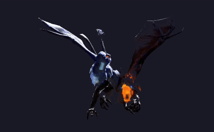

<div align="center">

# 👋 Hi, I'm Anthony Dorly


</div>

---

## 🚀 About Me

<table>
<tr>
<td width="55%">

### 📝 Quick Info
```typescript
const anthony = {
  location: "Arequipa, Perú 🇵🇪",
  education: "Software Engineering with AI @ SENATI",
  work: "Software Dev Intern @ Brighter Perú",
  code: ["Python", "JavaScript", "Kotlin", "Java"],
  learning: ["Haskell λ", "English 🇬🇧"],
  hobbies: ["Gaming 🎮", "Anime 🎌", "Coding 💻"],
  funFact: "I learn Haskell for fun 🤓"
};
```

</td>
<td width="45%">


</td>
</tr>
</table>

---

## 🛠️ Tech Stack

<div align="center">

### Languages


### Platforms & Frameworks


### Database & Tools


### Currently Learning


</div>

---

## 🎮 Favorite Games

<div align="center">

<table>
<tr>
<td align="center" width="25%">

<br>
<b>🛡️ Dota 2</b>
</td>
<td align="center" width="25%">

<br>
<b>🎯 Overwatch</b>
</td>
<td align="center" width="25%">

<br>
<b>🧟 Left 4 Dead 2</b>
</td>
<td align="center" width="25%">

<br>
<b>🌀 Portal</b>
</td>
</tr>
</table>

</div>

---

## 🐉 Main Hero

<div align="center">




</div>


## 🔥 GitHub Streak

<div align="center">


</div>

---

## 🐍 Contribution Snake

<div align="center">

<picture>
  <source media="(prefers-color-scheme: dark)" srcset="https://raw.githubusercontent.com/ANTDOR9/ANTDOR9/output/github-snake-dark.svg">
  <source media="(prefers-color-scheme: light)" srcset="https://raw.githubusercontent.com/ANTDOR9/ANTDOR9/output/github-snake.svg">
  
</picture>

</div>

---

## 📫 Connect With Me

<div align="center">

[](https://www.facebook.com/anthony.huilahuana/)
[](https://www.instagram.com/borealis_visual/)
[](https://www.linkedin.com/in/anthony-dorly-huilahua%C3%B1a-chata-b1617b216/)
[](https://steamcommunity.com/profiles/76561198253922532/)

</div>

---

<div align="center">


### 🎮 GG WP — see you in the next commit 💜

</div>
